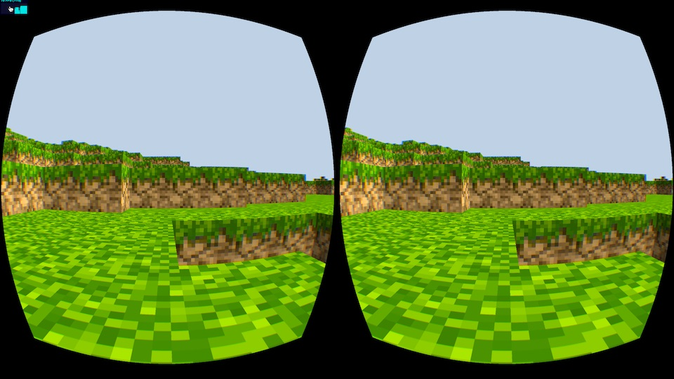
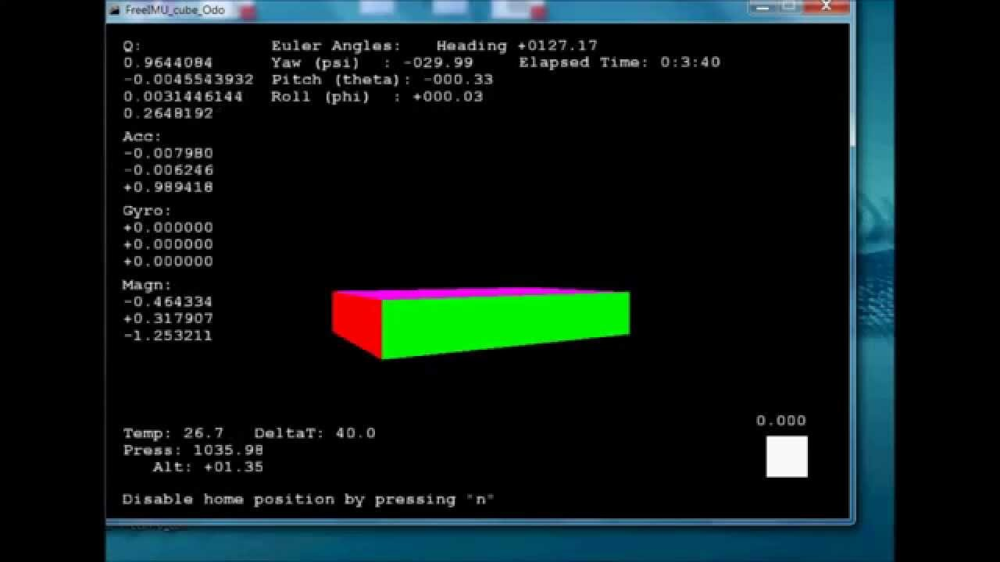

#Oculus  + Node.js  + Three.js 打造VR世界

> Oculus Rift 是一款为电子游戏设计的头戴式显示器。这是一款虚拟现实设备。这款设备很可能改变未来人们游戏的方式。

本作品采用[知识共享署名-非商业性使用 4.0 国际许可协议](http://creativecommons.org/licenses/by-nc/4.0/)进行许可。© 2015 [Phodal Huang](http://www.phodal.com)。[待我代码编成，娶你为妻可好](http://www.xuntayizhan.com/person/ji-ke-ai-qing-zhi-er-shi-dai-wo-dai-ma-bian-cheng-qu-ni-wei-qi-ke-hao-wan/) @[花仲马](http://weibo.com/hug8217)


在上周五——也是Hackay的第三天的时候，突然有了点小灵感，便将闲置在公司的Oculus DK2借回家了——已经都是灰尘了~~。

在尝试一个晚上开发环境搭建后，我放弃了。一是没有属于自己的电脑（如果Raspberry Pi不算的话）——没有Windows、没有GNU/Linux，二是公司配的电脑是Mac OS。对于嵌入式开发和游戏开发来说，Mac OS简直是手机中的Windows Phone——坑爹的LLVM、GCC(Mac OS )、OpenGL、OGLPlus、C++11。尝试了一晚上后，放弃了原生的念头。

Web的开发环境到底还是比较容易搭建的。

##Node Oculus Services

###安装Node NMD

Node.js上有一个Oculus的插件名为node-hmd，hmd即面向头戴式显示器。它就是Oculus SDK的Node接口，虽说年代已经有些久远了，但是似乎是可以用的——官方针对 Mac OS和Linux的SDK也已经很久没有更新了。

在GNU/Linux系统下，你需要安装下面的这些东西的

```
freeglut3-dev
mesa-common-dev
libudev-dev
libxext-dev
libxinerama-dev
libxrandr-dev
libxxf86vm-dev
```

Mac OS如果安装失败，请使用Clang来，以及GCC的C标准库（PS： 就是 Clang + GCC的混合体，它们之间就是各种复杂的关系。。）：

```
export CXXFLAGS=-stdlib=libstdc++

export CC=/usr/bin/clang
export CXX=/usr/bin/clang++
```

（PS： 我使用的是Mac OS El Captian + Xcode 7.0. 2）clang版本如下:

```
Apple LLVM version 7.0.2 (clang-700.1.81)
Target: x86_64-apple-darwin15.0.0
Thread model: posix
```

反正都是会报错的:

```
ld: warning: object file (Release/obj.target/hmd/src/platform/mac/LibOVR/Src/Service/Service_NetClient.o) was built for newer OSX version (10.7) than being linked (10.5)
ld: warning: object file (Release/obj.target/hmd/src/platform/mac/LibOVR/Src/Tracking/Tracking_SensorStateReader.o) was built for newer OSX version (10.7) than being linked (10.5)
ld: warning: object file (Release/obj.target/hmd/src/platform/mac/LibOVR/Src/Util/Util_ImageWindow.o) was built for newer OSX version (10.7) than being linked (10.5)
ld: warning: object file (Release/obj.target/hmd/src/platform/mac/LibOVR/Src/Util/Util_Interface.o) was built for newer OSX version (10.7) than being linked (10.5)
ld: warning: object file (Release/obj.target/hmd/src/platform/mac/LibOVR/Src/Util/Util_LatencyTest2Reader.o) was built for newer OSX version (10.7) than being linked (10.5)
ld: warning: object file (Release/obj.target/hmd/src/platform/mac/LibOVR/Src/Util/Util_Render_Stereo.o) was built for newer OSX version (10.7) than being linked (10.5)
node-hmd@0.2.1 node_modules/node-hmd
```

不过，有最后一行就够了。

###Node.js Oculus Hello，World

现在，我们就可以写一个Hello，World了，直接来官方的示例~~。

```javascript
var hmd = require('node-hmd');

var manager = hmd.createManager("oculusrift");

manager.getDeviceInfo(function(err, deviceInfo) {
    if(!err) {
        console.log(deviceInfo);
    }
    else {
        console.error("Unable to retrieve device information.");
    }
});

manager.getDeviceOrientation(function(err, deviceOrientation) {
    if(!err) {
        console.log(deviceOrientation);
    }
    else {
        console.error("Unable to retrieve device orientation.");
    }
});
```

运行之前，记得先连上你的Oculus。会有类似于下面的结果:

```javascript
{ CameraFrustumFarZInMeters: 2.5,
  CameraFrustumHFovInRadians: 1.29154372215271,
  CameraFrustumNearZInMeters: 0.4000000059604645,
  CameraFrustumVFovInRadians: 0.942477822303772,
  DefaultEyeFov:
   [ { RightTan: 1.0923680067062378,
       LeftTan: 1.0586576461791992,
       DownTan: 1.3292863368988037,
       UpTan: 1.3292863368988037 },
     { RightTan: 1.0586576461791992,
       LeftTan: 1.0923680067062378,
       DownTan: 1.3292863368988037,
       UpTan: 1.3292863368988037 } ],
  DisplayDeviceName: '',
  DisplayId: 880804035,
  DistortionCaps: 66027,
  EyeRenderOrder: [ 1, 0 ],
  ...
```

接着，我们就可以实时返回这些数据了。

###Node Oculus WebSocket

在网上看到[http://laht.info/WebGL/DK2Demo.html](http://laht.info/WebGL/DK2Demo.html)这个虚拟现实的电影，并且发现了它有一个WebSocket，然而是Java写的，只能拿来当参考代码。

现在我们就可以写一个这样的Web Services，用的仍然是Express + Node.js + WS。

```javascript
var hmd = require("node-hmd"),
    express = require("express"),
    http = require("http").createServer(),
    WebSocketServer = require('ws').Server,
    path = require('path');

// Create HMD manager object
console.info("Attempting to load node-hmd driver: oculusrift");
var manager = hmd.createManager("oculusrift");
if (typeof(manager) === "undefined") {
    console.error("Unable to load driver: oculusrift");
    process.exit(1);
}
// Instantiate express server
var app = express();
app.set('port', process.env.PORT || 3000);

app.use(express.static(path.join(__dirname + '/', 'public')));
app.set('views', path.join(__dirname + '/public/', 'views'));
app.set('view engine', 'jade');

app.get('/demo', function (req, res) {
    'use strict';
    res.render('demo', {
        title: 'Home'
    });
});

// Attach socket.io listener to the server
var wss = new WebSocketServer({server: http});
var id = 1;

wss.on('open', function open() {
    console.log('connected');
});

// On socket connection set up event emitters to automatically push the HMD orientation data
wss.on("connection", function (ws) {
    function emitOrientation() {
        id = id + 1;
        var deviceQuat = manager.getDeviceQuatSync();
        var devicePosition = manager.getDevicePositionSync();

        var data = JSON.stringify({
            id: id,
            quat: deviceQuat,
            position: devicePosition
        });

        ws.send(data, function (error) {
            //it's a bug of websocket, see in https://github.com/websockets/ws/issues/337
        });
    }

    var orientation = setInterval(emitOrientation, 1000);

    ws.on("message", function (data) {
        clearInterval(orientation);
        orientation = setInterval(emitOrientation, data);
    });

    ws.on("close", function () {
        setTimeout(null, 500);
        clearInterval(orientation);
        console.log("disconnect");
    });
});

// Launch express server
http.on('request', app);
http.listen(3000, function () {
    console.log("Express server listening on port 3000");
});
```


总之，就是连上的时候不断地发现设备的数据:

```javascript
var data = JSON.stringify({
    id: id,
    quat: deviceQuat,
    position: devicePosition
});

ws.send(data, function (error) {
    //it's a bug of websocket, see in https://github.com/websockets/ws/issues/337
});
```

上面有一行注释是我之前一直遇到的一个坑，总之需要callback就是了。

##Three.js + Oculus Effect  + DK2 Control

在最后我们需要如下的画面：



当然，如果你已经安装了Web VR这一类的东西，你就不需要这样的效果了。如标题所说，你已经知道要用Oculus Effect，它是一个Three.js的插件。

在之前的版本中，Three.js都提供了Oculus的Demo，当然只能用来看。并且交互的接口是HTTP，感觉很难玩~~。

##Three.js DK2Controls

这时，我们就需要根据上面传过来的``四元数``(Quaternions)与欧拉角(Euler angles)来作相应的处理。

```javascript
{
    "position": {
        "x": 0.020077044144272804,
        "y": -0.0040545957162976265,
        "z": 0.16216422617435455
    },
    "quat": {
        "w": 0.10187230259180069,
        "x": -0.02359195239841938,
        "y": -0.99427556991577148,
        "z": -0.021934293210506439
    }
}
```

###欧拉角与四元数

（ps: 如果没copy好，麻烦提出正确的说法，原谅我这个挂过高数的人。我只在高中的时候，看到这些资料。）

> 欧拉角是一组用于描述刚体姿态的角度，欧拉提出，刚体在三维欧氏空间中的任意朝向可以由绕三个轴的转动复合生成。通常情况下，三个轴是相互正交的。

对应的三个角度又分别成为roll（横滚角），pitch（俯仰角）和yaw（偏航角），就是上面的postion里面的三个值。。

```
roll = (rotation about Z);

pitch = (rotation about (Roll • Y));

yaw = (rotation about (Pitch • Raw • Z));”
```

-- 引自《Oculus Rift In Action》

转换成代码。。

```
this.headPos.set(sensorData.position.x * 10 - 0.4, sensorData.position.y * 10 + 1.75, sensorData.position.z * 10 + 10);
```

> 四元数是由爱尔兰数学家威廉·卢云·哈密顿在1843年发现的数学概念。

从明确地角度而言，四元数是复数的不可交换延伸。如把四元数的集合考虑成多维实数空间的话，四元数就代表着一个四维空间，相对于复数为二维空间。

反正就是用于``描述三维空间的旋转变换``。

结合下代码：

```javascript
this.headPos.set(sensorData.position.x * 10 - 0.4, sensorData.position.y * 10 + 1.75, sensorData.position.z * 10 + 10);
this.headQuat.set(sensorData.quat.x, sensorData.quat.y, sensorData.quat.z, sensorData.quat.w);

this.camera.setRotationFromQuaternion(this.headQuat);
this.controller.setRotationFromMatrix(this.camera.matrix);
```

就是，我们需要设置camera和controller的旋转。

这使我有足够的理由相信Oculus就是一个手机 + 一个6轴运动处理组件的升级板——因为，我玩过MPU6050这样的传感器，如图。。。




###Three.js  DK2Controls

虽然下面的代码不是我写的，但是还是简单地说一下。

```javascript
/*
 Copyright 2014 Lars Ivar Hatledal
 Licensed under the Apache License, Version 2.0 (the "License");
 you may not use this file except in compliance with the License.
 You may obtain a copy of the License at
 http://www.apache.org/licenses/LICENSE-2.0
 Unless required by applicable law or agreed to in writing, software
 distributed under the License is distributed on an "AS IS" BASIS,
 WITHOUT WARRANTIES OR CONDITIONS OF ANY KIND, either express or implied.
 See the License for the specific language governing permissions and
 limitations under the License.
 */

THREE.DK2Controls = function (camera) {

    this.camera = camera;
    this.ws;
    this.sensorData;
    this.lastId = -1;

    this.controller = new THREE.Object3D();

    this.headPos = new THREE.Vector3();
    this.headQuat = new THREE.Quaternion();

    var that = this;
    var ws = new WebSocket("ws://localhost:3000/");
    ws.onopen = function () {
        console.log("### Connected ####");
    };

    ws.onmessage = function (evt) {
        var message = evt.data;
        try {
            that.sensorData = JSON.parse(message);
        } catch (err) {
            console.log(message);
        }
    };

    ws.onclose = function () {
        console.log("### Closed ####");
    };

    this.update = function () {

        var sensorData = this.sensorData;
        if (sensorData) {
            var id = sensorData.id;
            if (id > this.lastId) {
                this.headPos.set(sensorData.position.x * 10 - 0.4, sensorData.position.y * 10 + 1.75, sensorData.position.z * 10 + 10);
                this.headQuat.set(sensorData.quat.x, sensorData.quat.y, sensorData.quat.z, sensorData.quat.w);

                this.camera.setRotationFromQuaternion(this.headQuat);
                this.controller.setRotationFromMatrix(this.camera.matrix);
            }
            this.lastId = id;
        }


        this.camera.position.addVectors(this.controller.position, this.headPos);
        if (this.camera.position.y < -10) {
            this.camera.position.y = -10;
        }

        if (ws) {
            if (ws.readyState === 1) {
                ws.send("get\n");
            }
        }

    };
};
```

打开WebSocket的时候，不断地获取最新的传感器状态，然后update。谁在调用update方法？Three.js

我们需要在我们的初始化代码里初始化我们的control：

```javascript
var oculusControl;

function init() {
        ...
	oculusControl = new THREE.DK2Controls( camera );
	...
}
```

并且不断地调用update方法。

```javascript
function animate() {
    requestAnimationFrame( animate );
    render();
    stats.update();
}
function render() {
    oculusControl.update( clock.getDelta() );
    THREE.AnimationHandler.update( clock.getDelta() * 100 );

    camera.useQuaternion = true;
    camera.matrixWorldNeedsUpdate = true;

    effect.render(scene, camera);
}
```

最后，添加相应的KeyHandler就好了~~。
